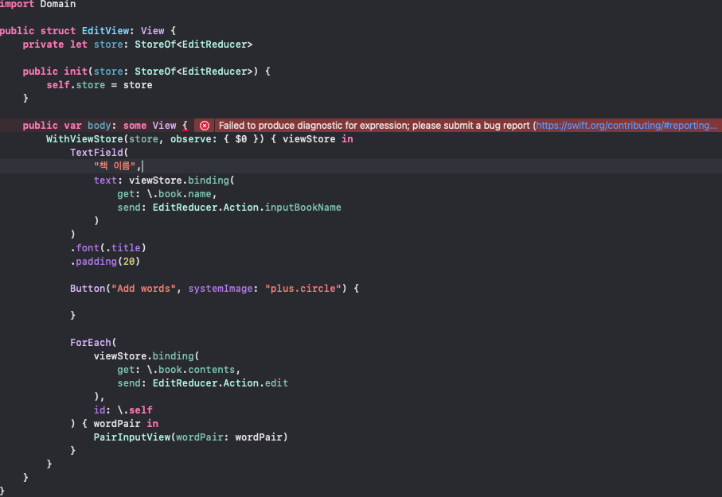

# SpeechCard trouble shooting

## ForEach 사용시 Failed to produce diagnostic for expression 에러 발생



```swift
import SwiftUI

import ComposableArchitecture
import Domain

public struct EditView: View {
    private let store: StoreOf<EditReducer>
    
    public init(store: StoreOf<EditReducer>) {
        self.store = store
    }
    
    public var body: some View {
        WithViewStore(store, observe: { $0 }) { viewStore in
            TextField(
                "책 이름",
                text: viewStore.binding(
                    get: \.book.name,
                    send: EditReducer.Action.inputBookName
                )
            )
            .font(.title)
            .padding(20)
            
            Button("Add words", systemImage: "plus.circle") {
                
            }
            
            ForEach(
                viewStore.binding(
                    get: \.book.contents,
                    send: EditReducer.Action.edit
                ),
                id: \.self
            ) { wordPair in
                PairInputView(wordPair: wordPair)
            }
        }
    }
}
```

- `book.contents`(`[DefaultWordPair]`)가 Identifiable을 준수하지 않아서 그럴까?
    - `DefaultWordPair`가 준수하는 `WordPairType`이 `Identifiable` 준수하도록 해봐도 동일한 에러 발생

### 원인 및 해결


- 제너릭 함수인 `viewStore.binding<Value>`는 `get`, `send` 파라미터로 타입 추론을 하는데 두 파라미터의 타입이 서로 불일치 하므로 에러 발생
    - `get`은 `Value`가 `DefaultWordPairs`
    - `send`는 `Value`가 **`any** WordPairType`
- `EditReducer.Action.edit`의 Associated value를 `DefaultWordPairs`으로 변경
