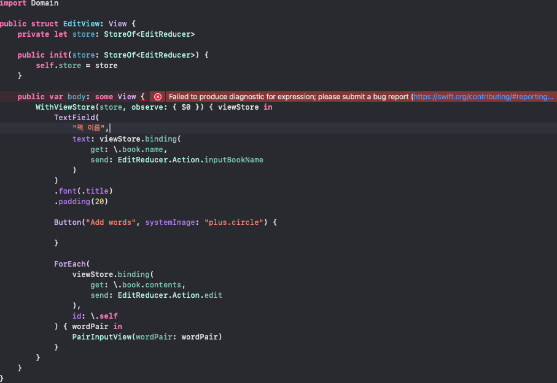

# SpeechCard trouble shooting

## ForEach 사용시 Failed to produce diagnostic for expression 에러 발생



```swift
//
//  EditView.swift
//  Edit
//
//  Created by Taeyoung Son on 1/30/24.
//

import SwiftUI

import ComposableArchitecture
import Domain

public struct EditView: View {
    private let store: StoreOf<EditReducer>
    
    public init(store: StoreOf<EditReducer>) {
        self.store = store
    }
    
    public var body: some View {
        WithViewStore(store, observe: { $0 }) { viewStore in
            TextField(
                "책 이름",
                text: viewStore.binding(
                    get: \.book.name,
                    send: EditReducer.Action.inputBookName
                )
            )
            .font(.title)
            .padding(20)
            
            Button("Add words", systemImage: "plus.circle") {
                
            }
            
            ForEach(
                viewStore.binding(
                    get: \.book.contents,
                    send: EditReducer.Action.edit
                ),
                id: \.self
            ) { wordPair in
                PairInputView(wordPair: wordPair)
            }
        }
    }
}

#Preview {
    EditView(store: .init(initialState: .init(book: BookVO(name: "", targetLanguage: .korean, originLanguage: .english, contents: [])), reducer: { EditReducer(useCase: EditUseCaseStub()) }))
}
```

- `book.contents`(`[DefaultWordPair]`)가 Identifiable을 준수하지 않아서 그럴까?
    - `DefaultWordPair`가 준수하는 `WordPairType`이 `Identifiable` 준수하도록 해봐도 동일한 에러 발생
